# CYBER SMASH

**Play it: https://fsystemweb.github.io/cybersmash-II/**

A comedic 3D browser game, a love letter to the "wreck the car" bonus stage of early-90s arcade
fighters. A sweaty harbor salesman can't sell his ugly, angular, "bulletproof" electric pickup, the
**CYBERCHUNK**, so he'll pay anyone who can smash it with their bare hands in under **40 seconds**.

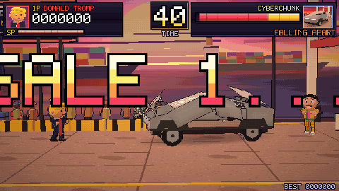

The whole game is a single `index.html`: three.js (pinned, via an import map) is the only dependency.
There is no build step and there are no asset files. Every model, texture, letter and sound is generated at runtime.

## Controls

| Action | Keyboard | Touch |
|---|---|---|
| Move | ← / → or A / D | `<` `>` |
| Punch (fast, 1× damage) | **J** | `J` |
| Kick (slower, longer reach, 1.5×) | **K** | `K` |
| Special move (3×, 3 s cooldown) | **L** | `L` |
| Start / confirm / restart | Space / Enter | `START` |
| Menus | arrows | `<` `>` |
| Back | Esc | |
| Mute | **M** | `M` |
| Hitbox overlay (debug) | H | |

On-screen buttons appear automatically on touch devices.

## How it plays

1. **Title → Select → VS → Fight → Results.**
2. The camera swoops around the harbor while the salesman makes his pitch, then **SALE 1… HAGGLE!**
3. You have 40 seconds. Hits only land when the truck is in range (kicks reach further). The truck
   rocks on its suspension, slides back, and goes through **four visible damage stages**:
   1. the "armored" glass cracks on the very first hit,
   2. panels **dent** (real vertex displacement),
   3. the hood, doors, tonneau and windshield **fly off** with physics,
   4. the frame **collapses into a pile** around a smoking, sparking battery.
4. Wreck it in time for **PERFECT!** plus a time bonus (remaining seconds × 1000). If the clock runs out
   it's **SALE CANCELLED**: your fighter strikes their defeat pose and the salesman celebrates.
5. The results screen shows score, time remaining and hits landed, with your fighter posing on a rotating
   pedestal. You can retry or pick another fighter. The best score is kept for the session.

Scoring: every hit is worth damage × 10 points. The clock freezes while a special move plays.

## The fighters

| | Fighter | Special (L) |
|---|---|---|
| 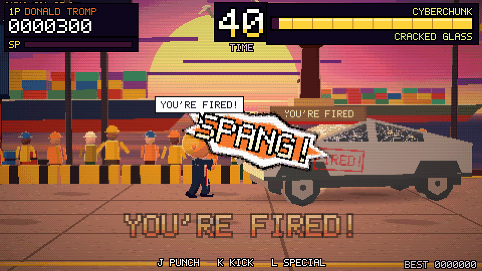 | **Donald Tromp**: huge flapping red tie, golden swoop with a mind of its own | **YOU'RE FIRED!** A giant rubber stamp drops from the sky and leaves a FIRED! decal |
| 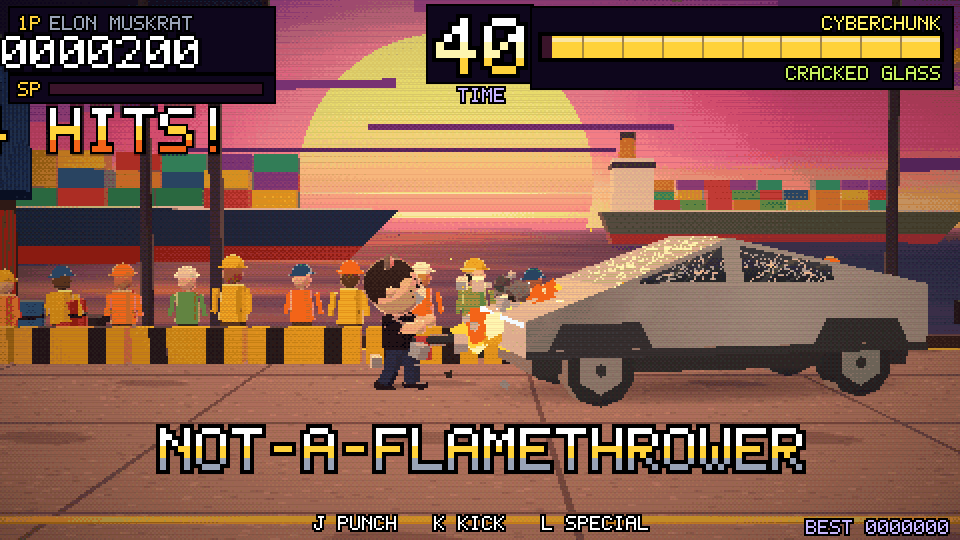 | **Elon Muskrat**: black tee, smug grin, tiny rodent ears | **Not-A-Flamethrower** scorches his own product… then he apologises to the camera |
| 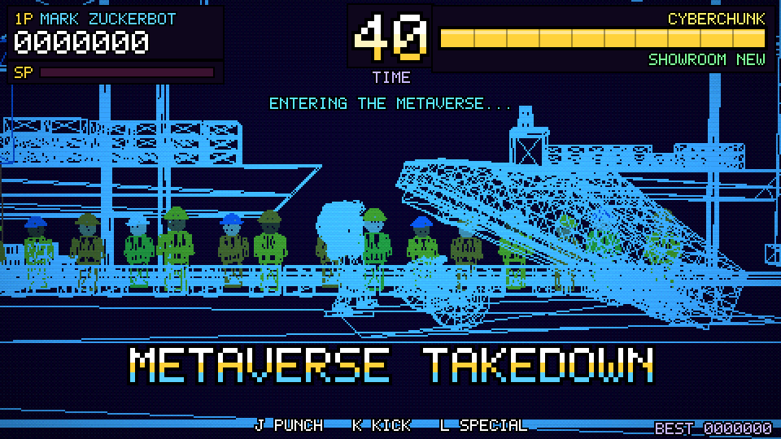 | **Mark Zuckerbot**: grey hoodie, VR headset on the forehead, robotic blinking | **Metaverse Takedown**: a jiu-jitsu slam while the whole world turns wireframe |
| 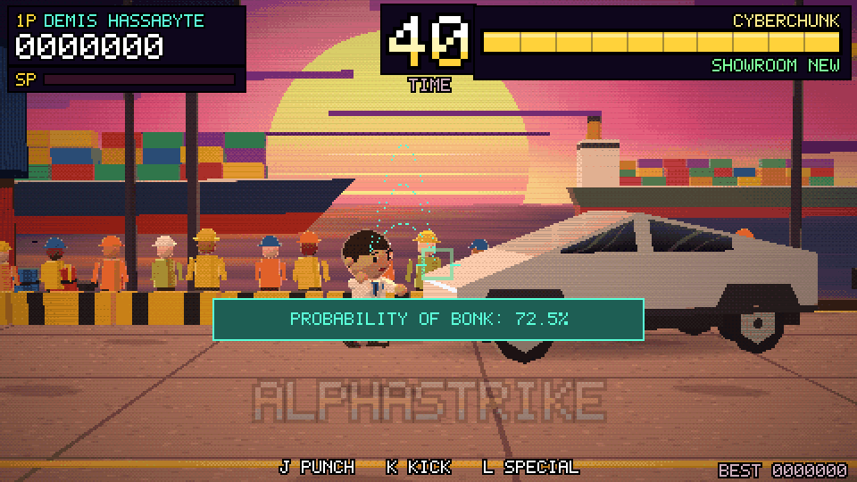 | **Demis Hassabyte**: calm scientist in a lab coat | **AlphaStrike**: time slows, trajectory lines and PROBABILITY OF BONK: 99.7%, then one perfect hit |
| 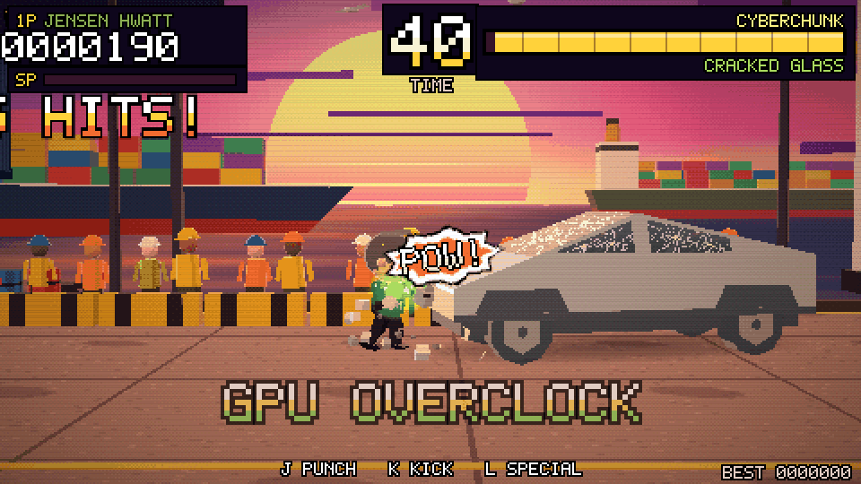 | **Jensen Hwatt**: glossy black leather jacket | **GPU Overclock**: green glowing fists and a flurry of punches |
| 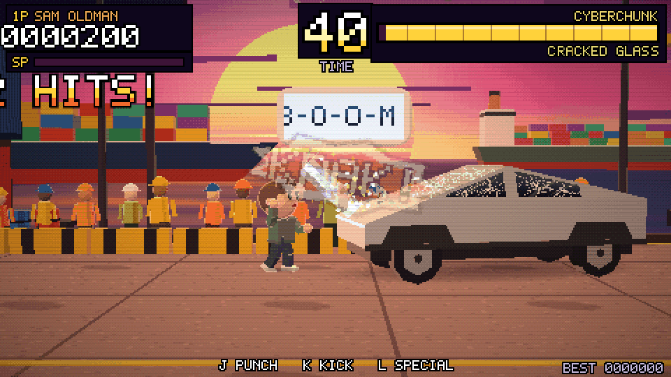 | **Sam Oldman**: earnest sweater, big eyes | **AGI Beam**: a giant chat bubble types B-O-O-M, then fires a laser |

All characters are affectionate parody caricatures with parody names. The jokes are meant to be funny, never mean.

## Screenshots

| | |
|---|---|
| 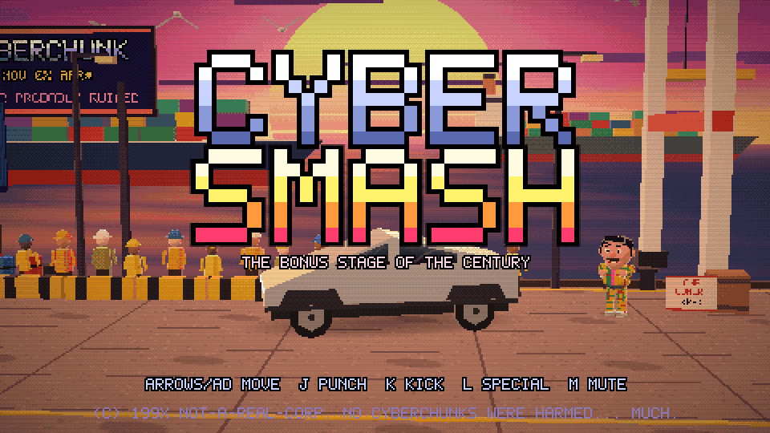 | 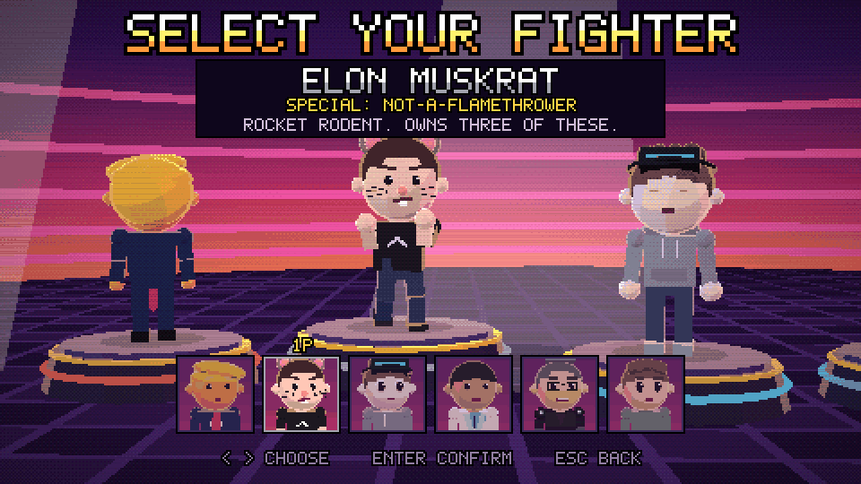 |
| 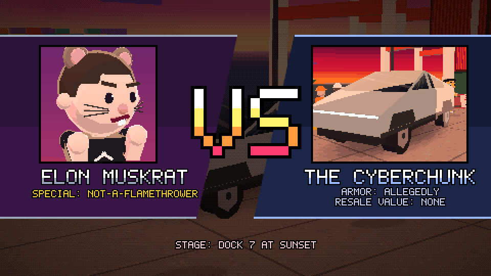 | 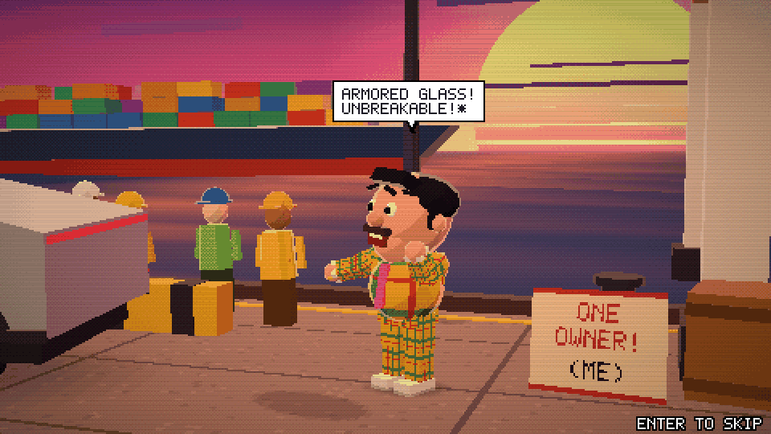 |
| 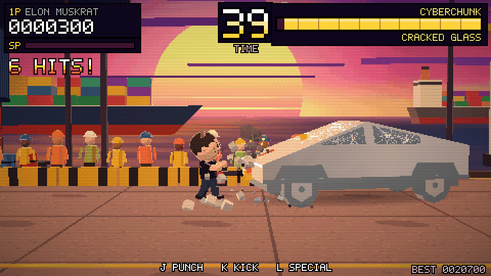 | 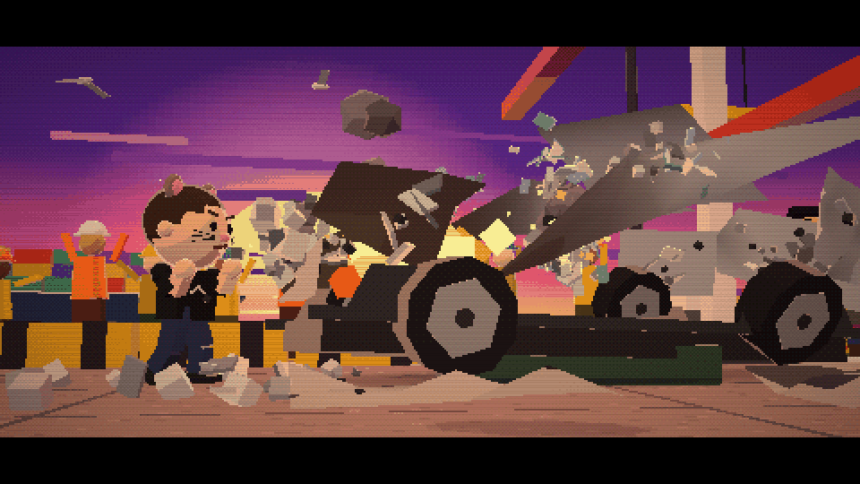 |
| 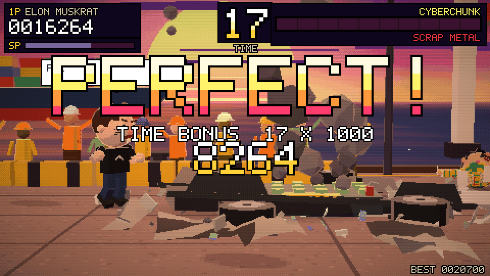 | 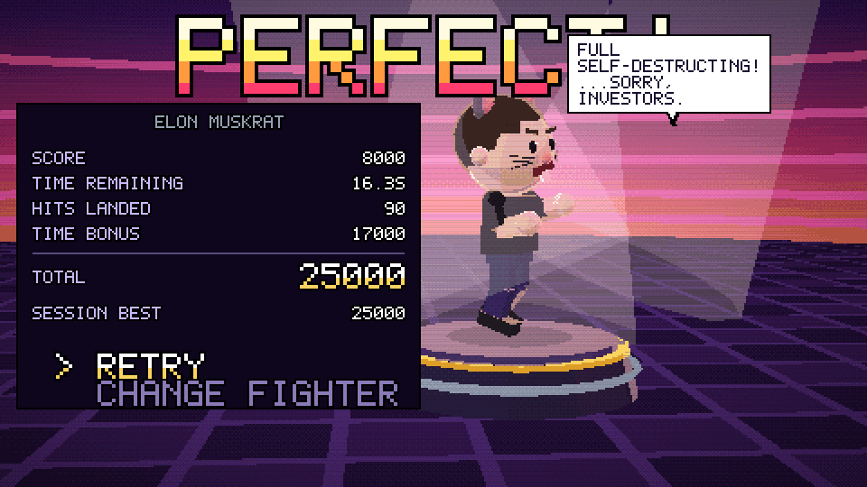 |
| 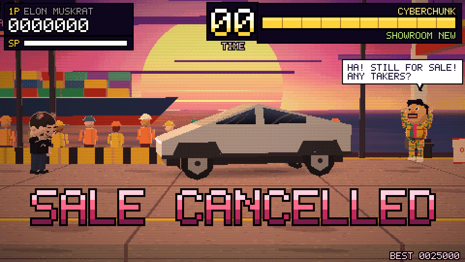 | 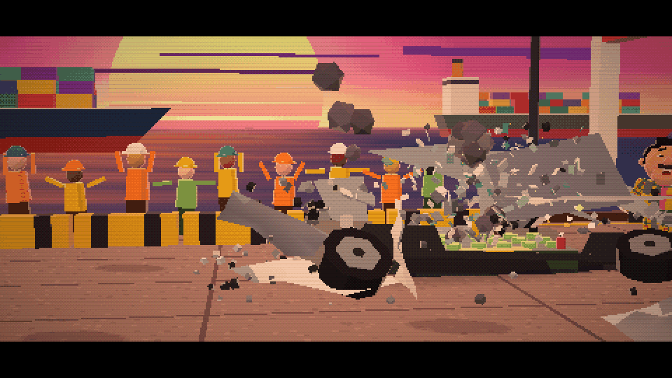 |

## Under the hood

- **Rendering**: three.js `0.160.0`. The 3D scene renders into a **480×270 render target**, then a
  fullscreen pass upscales it with nearest-neighbour sampling, an ordered-dither posterise, scanlines and a
  vignette. Materials are 3-band **toon** shading with an injected hard rim light, and shadows are blob shadows.
  The 16:9 stage is letterboxed to any window, and devicePixelRatio is capped at 2.
- **Gameplay**: 2.5D. Everything moves on one side-view plane (X) with 1D hitbox/hurtbox ranges, and the
  simulation runs on a fixed 60 Hz timestep (hit-stop and slow-mo scale it).
- **Models**: built from primitives. Static scenery is merged into a few vertex-coloured meshes. The
  crowd, containers, seagulls, debris, smoke, sparks and shadows are `InstancedMesh`es. Each fighter's
  rig merges each joint into one mesh. The truck is made of subdivided quad panels, so hits can dent it.
- **Textures and text**: all `CanvasTexture` (cracked glass, plaid suit, billboard, comic bursts, the
  FIRED! stamp, the chat bubble). The lettering uses an original 5×7 pixel font defined in the source.
- **Audio**: synthesised with the Web Audio API (oscillators, filtered noise, envelopes). The context
  starts on the first input. M mutes.
- **Budget**: at most about 90 draw calls in any state (the target is under 150). Shaders are pre-compiled at load,
  idle particle pools skip work, and everything removed from the scene is disposed.

## Run locally

```bash
python3 -m http.server 8000      # or: npx http-server
# open http://localhost:8000
```

## Tests

Dev tooling only (the game itself has no dependencies besides three.js):

```bash
npm install && npx playwright install chromium
npm run smoke      # headless Chromium (SwiftShader WebGL): full flow, real input, bot match,
                   # time-out path, audio, mobile touch; fails on any console/WebGL error
npm run specials   # freezes each special mid-move, checks it deals 3x punch damage
node tests/record.mjs   # re-records screenshots/cybersmash.gif deterministically
node tests/smoke.mjs --url https://fsystemweb.github.io/cybersmash-II/   # test the live site
```

## Credits and IP

An original work made for fun. It takes inspiration only from the general feel of early-90s arcade
fighters (side-view fights, chunky HUD, dramatic VS screen, the bonus-stage concept) and copies no
existing game's characters, sprites, stages, fonts, logos, music, sound effects or announcer lines.
The fighters and the truck are parodies, and no real products or people were harmed.
